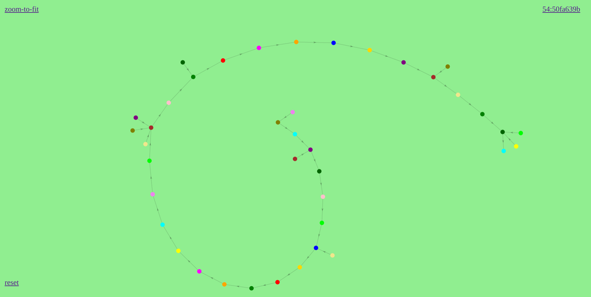

# forcecons
distributed protocols r&amp;d framework


visualisation for consensus protocols r&d


### keys generation
```bash
# generate new keys
node utils/genkeyaddr.js --key keys/k0.json --port 10000 --bootnodes bootnodes.json --pwd keys/pwd
# test keys
node utils/testkeyaddr.js --key keys/k0.json --pwd keys/pwd

# generate 16 keys
./gen16_json.sh
# test 16 keys
./test16_json.sh
```
